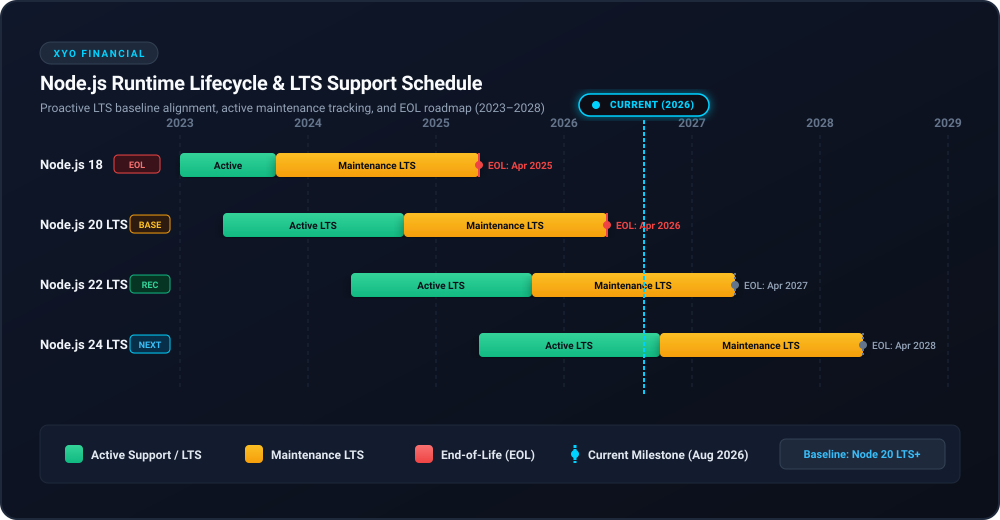

# 🛡️ Security Policy

## 📋 Supported Versions

Only the `2.0.0` release of the XYO Node.js SDK receives active security updates and patches.

| Version | Supported |
| ------- | --------- |
| 2.0.0   | :white_check_mark: |
| < 2.0.0 | :x: |

## ⚙️ Runtime Lifecycle & LTS Support Policy

XYO Financial strictly supports official Node.js LTS releases. We guarantee support for the minimum supported runtime version (currently Node.js 20 LTS+) and proactively update our baseline and release upgrades 3 months before a release reaches official End-of-Life (EOL).

### 📊 Runtime Support Matrix

| Node.js Release | Status | Initial Release | Active LTS Start | Maintenance LTS Start | End-of-Life (EOL) | SDK Support Level |
| :--- | :--- | :--- | :--- | :--- | :--- | :--- |
| **Node.js 24** | Active LTS | April 2025 | October 2025 | October 2026 | April 2028 | :white_check_mark: Supported |
| **Node.js 22 LTS** | Maintenance LTS | April 2024 | October 2024 | October 2025 | April 2027 | :white_check_mark: Recommended &amp; Supported |
| **Node.js 20 LTS** | Maintenance / Baseline | April 2023 | October 2023 | October 2024 | April 2026 | :white_check_mark: Minimum Supported Baseline |
| **Node.js 18** | End-of-Life | April 2022 | October 2022 | October 2023 | April 2025 | :x: Unsupported (EOL) |
| **Node.js &le; 16** | End-of-Life | Prior | Prior | Prior | Prior | :x: Unsupported (EOL) |

## 🚨 Reporting a Vulnerability

If you discover a potential security vulnerability in this SDK, please do not report it publicly through a GitHub issue. Instead, report it privately:

- **Email:** security@syniol.com
- **Response Time:** We will acknowledge receipt of your vulnerability report within 48 hours and provide a detailed response on next steps within 5 business days.
